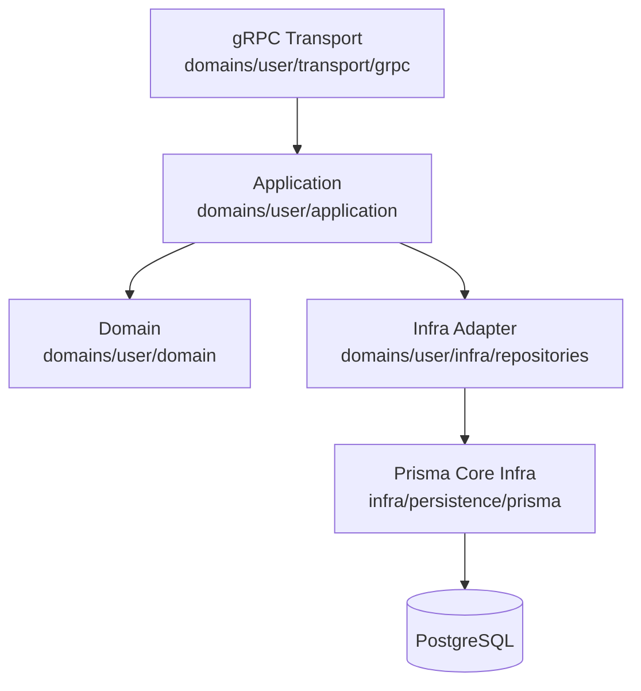
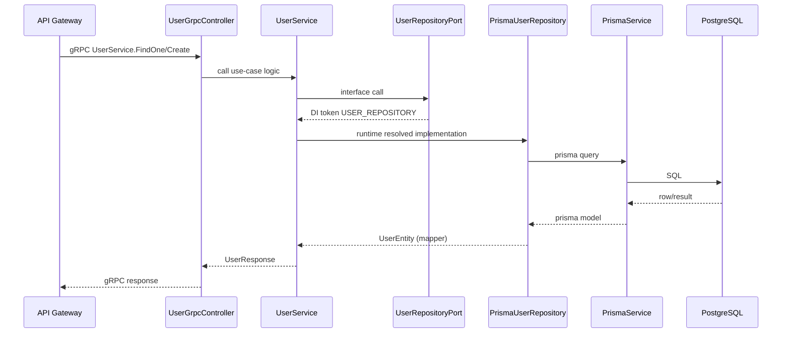
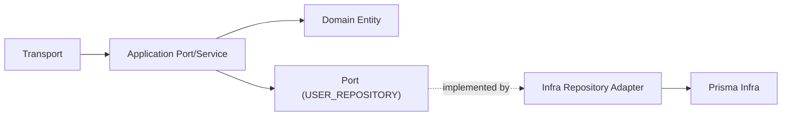

# User Service Architecture

현재 `apps/user` 서비스의 실제 구조를 기준으로 작성한 아키텍처 문서입니다.

## 1. Layer Structure



## 2. Request Flow (FindOne/Create)



## 3. Dependency Direction



## 4. Current Folder Map

```text
apps/user/src
├── domains/user
│   ├── application
│   │   ├── ports
│   │   └── services
│   ├── domain
│   │   └── entities
│   ├── infra
│   │   ├── mappers
│   │   └── repositories
│   └── transport
│       └── grpc
└── infra/persistence/prisma
    ├── prisma.module.ts
    ├── prisma.service.ts
    └── generated/*
```

