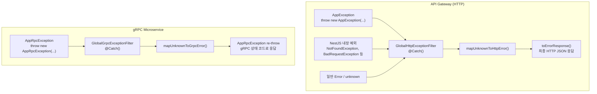
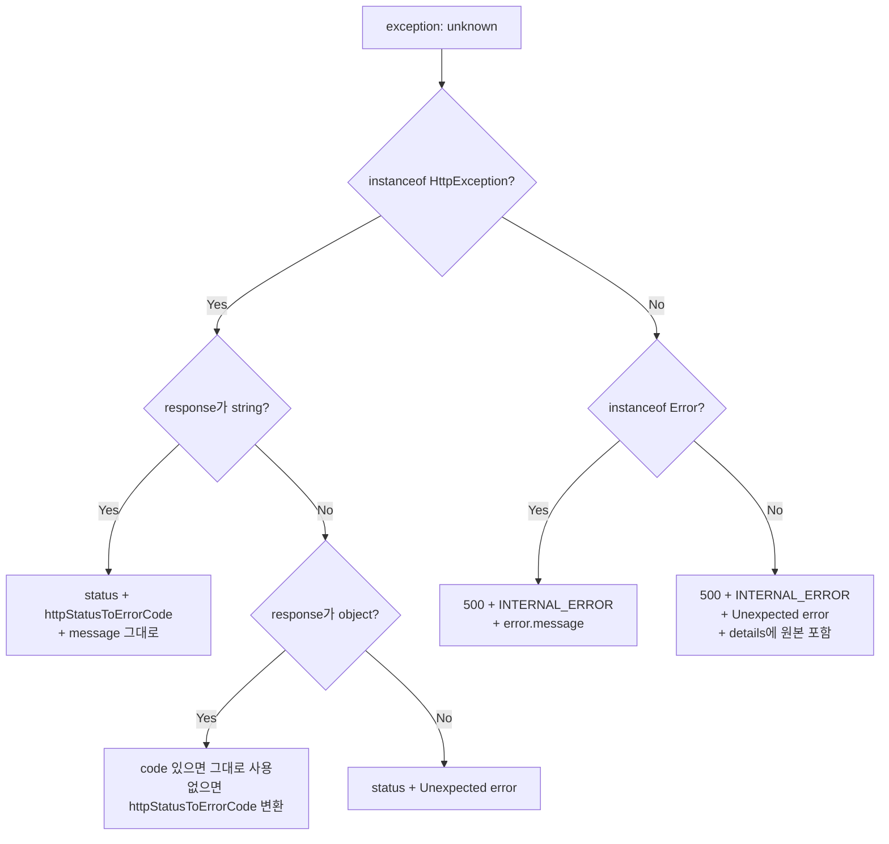
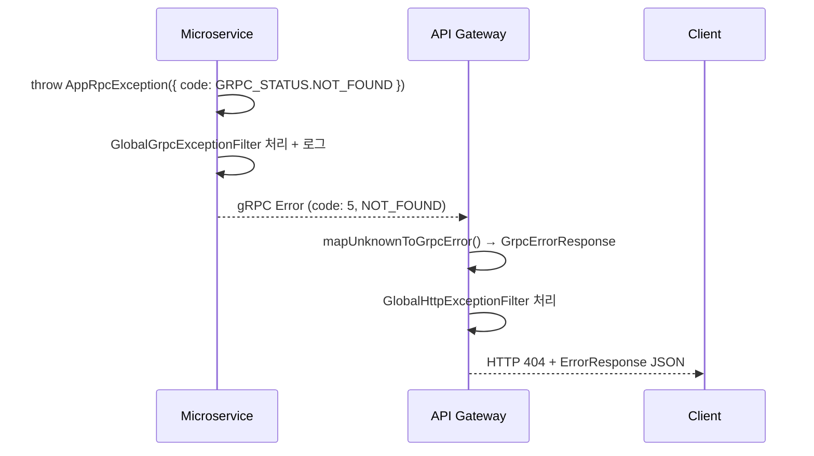
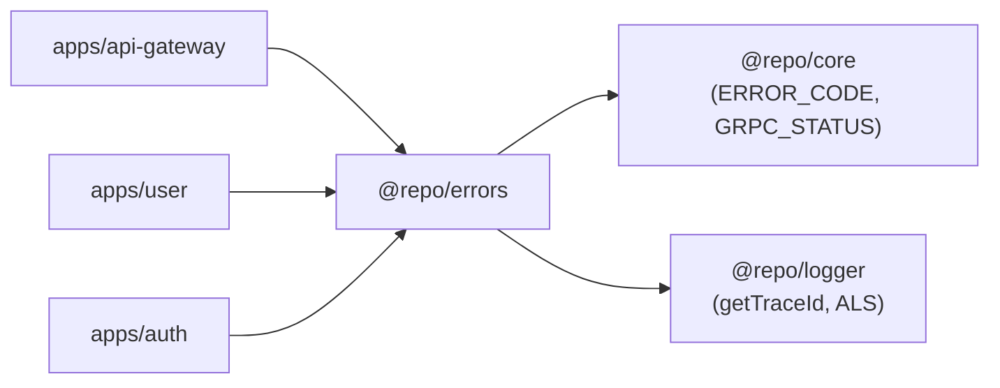

# @repo/errors

HTTP와 gRPC 양쪽에서 발생하는 예외를 **일관된 포맷**으로 처리하는 공유 패키지입니다.  
예외 클래스, 에러 매퍼, 전역 예외 필터를 제공하며 `@repo/core`의 `ERROR_CODE` / `GRPC_STATUS`를 기반으로 동작합니다.

---

## 패키지 구조

```
packages/errors/src/
├── exceptions/
│   ├── app.exception.ts          # HTTP 예외 (AppException)
│   └── app-rpc.exception.ts      # gRPC 예외 (AppRpcException)
├── filters/
│   ├── http-exception.filter.ts  # HTTP 전역 예외 필터
│   └── grpc-exception.filter.ts  # gRPC 전역 예외 필터
├── mappers/
│   ├── http.mapper.ts            # unknown → HttpErrorResponse 변환
│   ├── grpc.mapper.ts            # unknown → GrpcErrorResponse 변환
│   └── utils.mapper.ts           # 상태 코드 매핑 유틸
├── interfaces/
│   ├── error-response.ts         # HTTP 에러 인터페이스
│   └── grpc-error-response.ts    # gRPC 에러 인터페이스
└── index.ts
```

---

## 전체 에러 처리 흐름



---

## 예외 클래스

### AppException (HTTP)

`HttpException`을 상속하며, `code` / `status` / `message` / `details`를 통일된 구조로 감쌉니다.

```typescript
import { AppException } from '@repo/errors';
import { ERROR_CODE } from '@repo/core';
import { HttpStatus } from '@nestjs/common';

// 기본 사용 (code 생략 시 INTERNAL_ERROR, status 생략 시 500)
throw new AppException({ message: '처리 중 오류가 발생했습니다.' });

// 권장 사용 (code + status 명시)
throw new AppException({
  code: ERROR_CODE.NOT_FOUND,
  status: HttpStatus.NOT_FOUND,
  message: '사용자를 찾을 수 없습니다.',
});

// 상세 정보 포함
throw new AppException({
  code: ERROR_CODE.VALIDATION_ERROR,
  status: HttpStatus.BAD_REQUEST,
  message: '입력값이 올바르지 않습니다.',
  details: { field: 'email', reason: '이메일 형식이 아닙니다.' },
});
```

| 옵션 | 타입 | 기본값 | 설명 |
|------|------|--------|------|
| `message` | `string` | 필수 | 에러 메시지 |
| `code` | `ErrorCode` | `INTERNAL_ERROR` | `@repo/core`의 `ERROR_CODE` |
| `status` | `HttpStatus` | `500` | HTTP 상태 코드 |
| `details` | `unknown` | `undefined` | 추가 상세 정보 |

### AppRpcException (gRPC)

`RpcException`을 상속하며, gRPC 상태 코드(`GRPC_STATUS`)를 기반으로 동작합니다.

```typescript
import { AppRpcException } from '@repo/errors';
import { GRPC_STATUS, ERROR_CODE } from '@repo/core';

// 기본 사용
throw new AppRpcException({
  code: GRPC_STATUS.NOT_FOUND,
  message: '사용자를 찾을 수 없습니다.',
});

// errorCode 함께 전달 (게이트웨이에서 변환 시 활용)
throw new AppRpcException({
  code: GRPC_STATUS.UNAUTHENTICATED,
  message: '인증이 필요합니다.',
  errorCode: ERROR_CODE.UNAUTHORIZED,
});
```

| 옵션 | 타입 | 기본값 | 설명 |
|------|------|--------|------|
| `code` | `GrpcStatusCode` | `UNKNOWN (2)` | gRPC 상태 코드 |
| `message` | `string \| string[]` | `Internal server error` | 에러 메시지 |
| `errorCode` | `ErrorCode` | `undefined` | 도메인 에러 코드 |

---

## 전역 예외 필터

### GlobalHttpExceptionFilter

`@Catch()` 데코레이터로 모든 예외를 잡아 일관된 HTTP 응답으로 변환합니다.  
API Gateway의 `app.module.ts`에 `APP_FILTER`로 전역 등록합니다.

```typescript
// apps/api-gateway/src/app.module.ts
{
  provide: APP_FILTER,
  useClass: GlobalHttpExceptionFilter,
}
```

#### 에러 타입별 처리 흐름



#### 응답 포맷

```json
{
  "success": false,
  "timestamp": "2026-03-24T06:00:00.000Z",
  "path": "/api/v1/users/123",
  "traceId": "550e8400-e29b-41d4-a716-446655440000",
  "error": {
    "code": "NOT_FOUND",
    "message": "사용자를 찾을 수 없습니다.",
    "details": null
  }
}
```

> `traceId`는 `x-trace-id` 헤더에서 읽거나 `@repo/logger`의 ALS에서 자동으로 주입됩니다.

### GlobalGrpcExceptionFilter

gRPC 마이크로서비스에서 발생하는 예외를 `AppRpcException`으로 정규화한 뒤 re-throw합니다.  
에러 로그도 여기서 함께 남깁니다.

```typescript
// apps/user/src/app.module.ts (또는 각 마이크로서비스)
{
  provide: APP_FILTER,
  useClass: GlobalGrpcExceptionFilter,
}
```

---

## 상태 코드 매핑

HTTP ↔ gRPC ↔ ErrorCode 간 변환 테이블입니다.

| HTTP Status | gRPC Status | ErrorCode |
|-------------|-------------|-----------|
| `400` | `INVALID_ARGUMENT (3)` | `BAD_REQUEST` |
| `401` | `UNAUTHENTICATED (16)` | `UNAUTHORIZED` |
| `403` | `PERMISSION_DENIED (7)` | `FORBIDDEN` |
| `404` | `NOT_FOUND (5)` | `NOT_FOUND` |
| `408` | `DEADLINE_EXCEEDED (4)` | `TIMEOUT` |
| `409` | `ALREADY_EXISTS (6)` | `CONFLICT` |
| `503` | `UNAVAILABLE (14)` | `SERVICE_UNAVAILABLE` |
| `5xx` | `INTERNAL (13)` | `INTERNAL_ERROR` |

### gRPC → HTTP 역방향 매핑 (게이트웨이에서 내부 서비스 에러 수신 시)

gRPC 마이크로서비스에서 던진 `AppRpcException`이 게이트웨이까지 전파될 때, `grpc.mapper.ts`가 이 테이블을 기반으로 HTTP 응답으로 변환합니다.



---

## 매퍼 유틸 함수

`utils.mapper.ts`에서 제공하는 변환 함수들입니다.

| 함수 | 입력 | 출력 | 설명 |
|------|------|------|------|
| `httpStatusToErrorCode` | `HttpStatus` | `ErrorCode` | HTTP 상태 → 도메인 코드 |
| `httpStatusToGrpcStatus` | `HttpStatus` | `GrpcStatusCode` | HTTP 상태 → gRPC 코드 |
| `grpcStatusCodeToErrorCode` | `GrpcStatusCode` | `ErrorCode` | gRPC 코드 → 도메인 코드 |
| `toGrpcStatusCode` | `unknown` | `GrpcStatusCode` | 숫자 값을 gRPC 코드로 안전하게 캐스팅 |
| `isErrorCode` | `unknown` | `boolean` | `ErrorCode` 타입 가드 |
| `normalizeMessage` | `unknown` | `string` | 문자열/배열 메시지 정규화 |
| `extractStack` | `unknown` | `string \| undefined` | 에러 스택 추출 |

---

## 인터페이스

### ErrorEnvelope (에러 응답 내부 객체)

```typescript
interface ErrorEnvelope {
  code: ErrorCode;    // 도메인 에러 코드
  message: string;
  details?: unknown;
}
```

### ErrorResponse (HTTP 최종 응답)

```typescript
interface ErrorResponse {
  success: false;
  timestamp: string;   // ISO 8601
  path?: string;       // 요청 경로
  traceId?: string;    // ALS에서 주입
  error: ErrorEnvelope;
}
```

### GrpcErrorResponse (gRPC 에러 내부 표현)

```typescript
interface GrpcErrorResponse {
  code: GrpcStatusCode;  // gRPC 상태 코드 (숫자)
  message: string;
  details?: unknown;
  metadata?: unknown;
  errorCode: ErrorCode;  // 도메인 에러 코드
}
```

---

## 패키지 의존성



---

## 사용 위치별 정리

| 위치 | 사용 항목 | 용도 |
|------|----------|------|
| API Gateway `app.module.ts` | `GlobalHttpExceptionFilter` | 전역 HTTP 예외 처리 |
| 각 마이크로서비스 `app.module.ts` | `GlobalGrpcExceptionFilter` | 전역 gRPC 예외 처리 |
| Gateway Controller / Service | `AppException` | HTTP 도메인 에러 throw |
| Microservice Service | `AppRpcException` | gRPC 도메인 에러 throw |
| JwtAuthGuard | `AppException` | 인증 에러 (401) |
