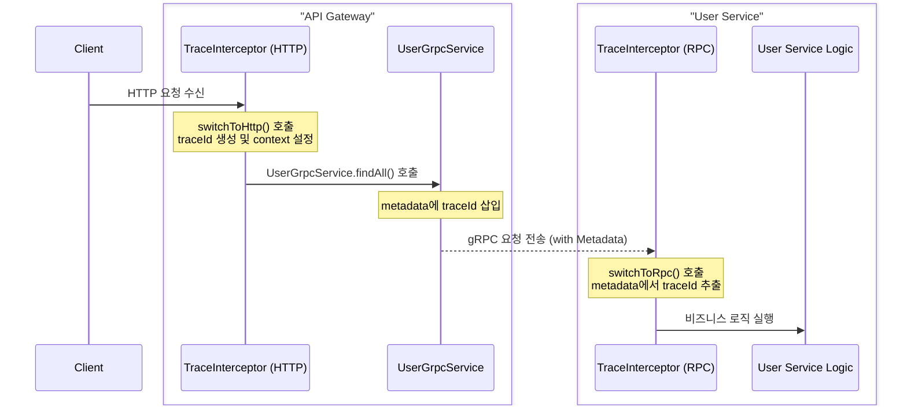

# @repo/logger

Winston 기반 NestJS 공유 로거 패키지 with Request Context Tracking

## ✨ 주요 기능

- 🎯 **Request Context**: AsyncLocalStorage 기반 traceId 자동 추적
- 🎨 **환경별 포맷**: 개발(읽기 쉬운 텍스트) / 프로덕션(JSON)
- 📁 **파일 로깅**: 서비스별 일별 로테이션
- 🔍 **마이크로서비스 지원**: 서비스명 자동 포함
- 🚀 **타입 안전**: TypeScript 완벽 지원

## 📦 설치

```bash
pnpm add '@repo/logger@workspace:*'
```

## 🔍 실행 흐름

```
[HTTP Request]
  ↓
Interceptor (traceId 생성)
  ↓
AsyncLocalStorage 초기화
  ↓
gRPC 호출 (metadata에 traceId 추가)
  ↓
Service (gRPC interceptor로 traceId 복원)
  ↓
AsyncLocalStorage 저장
  ↓
Service 내부 로깅

```



```
1. TraceInterceptor: requestContext.run({ traceId }, () => { ... })
   → getStore() = { traceId }

2. Guard: setRequestContext({ userId: '123' })
   → getStore() = { traceId, userId: '123' }

3. Service: setRequestContext({ orderId: 'order-456' })
   → getStore() = { traceId, userId: '123', orderId: 'order-456' }
```

## 🚀 빠른 시작

### 1. 모듈 등록

```typescript
// app.module.ts
import { Module } from '@nestjs/common';
import { APP_INTERCEPTOR } from '@nestjs/core';
import { LoggerModule, TraceInterceptor } from '@repo/logger';

@Module({
  imports: [
    LoggerModule.forRoot({
      serviceName: 'api-gateway', // 필수: 서비스 이름
      disableFileLog: false, // 선택: 파일 로그 비활성화
      level: 'info', // 선택: 로그 레벨
      logDir: 'logs', // 선택: 로그 디렉토리
      maxSize: '100m', // 선택: 파일 최대 크기
      maxFiles: '14d', // 선택: 보관 기간
    }),
  ],
  providers: [
    {
      provide: APP_INTERCEPTOR,
      useClass: TraceInterceptor, // TraceInterceptor 등록 (권장)
    },
  ],
})
export class AppModule {}
```

```typescript
// main.ts
import { NestFactory } from '@nestjs/core';
import { AppModule } from './app.module';
import { WINSTON_MODULE_NEST_PROVIDER } from '@repo/logger';

async function bootstrap() {
  const app = await NestFactory.create(AppModule);

  // Winston을 NestJS 기본 로거로 설정
  app.useLogger(app.get(WINSTON_MODULE_NEST_PROVIDER));

  await app.listen(3000);
}
bootstrap();
```

### 2. 서비스에서 사용 (권장)

```typescript
import { Injectable, Logger } from '@nestjs/common';

@Injectable()
export class UserService {
  private readonly logger = new Logger(UserService.name);
  //                       ^^^^^^^^^^^^^^^^^^^^^^^^^^
  //                       클래스명이 자동으로 context가 됨

  async createUser(data: CreateUserDto) {
    this.logger.log('Creating user');
    // → [api-gateway] [UserService] [abc12345] info: Creating user
    //                                ^^^^^^^^^ traceId 자동 포함!

    try {
      const user = await this.userRepository.save(data);
      this.logger.log('User created successfully');
      return user;
    } catch (error) {
      this.logger.error('Failed to create user', error.stack);
      throw error;
    }
  }
}
```

### 3. Controller에서 사용

```typescript
import { Controller, Get, Logger } from '@nestjs/common';

@Controller('users')
export class UserController {
  private readonly logger = new Logger(UserController.name);

  @Get()
  async findAll() {
    this.logger.log('Finding all users');
    return this.userService.findAll();
  }
}
```

## 📊 로그 출력 예시

### 개발 환경 (NODE_ENV !== 'production')

```bash
2025-01-05 15:30:00 [api-gateway] [UserService] [abc12345] info: Creating user
2025-01-05 15:30:01 [api-gateway] [UserRepository] [abc12345] info: Saving to database
2025-01-05 15:30:02 [api-gateway] [UserService] [abc12345] info: User created successfully
```

### 프로덕션 환경 (NODE_ENV === 'production')

```json
{
  "timestamp": "2025-01-05T15:30:00.000Z",
  "service": "api-gateway",
  "env": "production",
  "context": "UserService",
  "level": "info",
  "message": "Creating user",
  "traceId": "abc-123-def-456"
}
```

## 🎯 Request Context (동적 메타데이터 추가)

### Guard에서 인증 정보 추가

```typescript
import { Injectable, CanActivate, ExecutionContext } from '@nestjs/common';
import { setRequestContext } from '@repo/logger';

@Injectable()
export class AuthGuard implements CanActivate {
  canActivate(context: ExecutionContext): boolean {
    const request = context.switchToHttp().getRequest();
    const user = this.validateToken(request.headers.authorization);

    if (user) {
      // 컨텍스트에 사용자 정보 추가
      setRequestContext({
        userId: user.id,
        role: user.role,
        tenantId: user.tenantId,
      });
      return true;
    }

    return false;
  }
}
```

### Service에서 비즈니스 정보 추가

```typescript
@Injectable()
export class OrderService {
  private readonly logger = new Logger(OrderService.name);

  async createOrder(dto: CreateOrderDto) {
    // 주문 정보를 컨텍스트에 추가
    setRequestContext({
      orderId: 'order-123',
      amount: dto.amount,
    });

    this.logger.log('Processing order');
    // → [api-gateway] [OrderService] [abc12345] info: Processing order (userId: user-456, orderId: order-123, amount: 99.99)
  }
}
```

## 🔧 고급 사용법

### Winston 직접 사용

```typescript
import { Injectable, Inject } from '@nestjs/common';
import { WINSTON_MODULE_PROVIDER } from '@repo/logger';
import type { Logger } from 'winston';

@Injectable()
export class AdvancedService {
  constructor(
    @Inject(WINSTON_MODULE_PROVIDER)
    private readonly logger: Logger,
  ) {}

  doSomething() {
    // Winston의 모든 기능 사용 가능
    this.logger.info('Custom log', {
      customField: 'value',
      nested: { data: 'here' },
    });
  }
}
```

### Request Context 조회

```typescript
import { getTraceId, getRequestContext } from '@repo/logger';

// 현재 traceId만 가져오기
const traceId = getTraceId(); // 'abc-123-def-456'

// 전체 컨텍스트 가져오기
const context = getRequestContext();
// { traceId: 'abc-123', userId: 'user-456', role: 'admin' }
```

### Custom TraceId 전달 (마이크로서비스 간 통신)

```typescript
// HTTP 헤더로 traceId 전달
const response = await axios.get('http://user-service/users/123', {
  headers: {
    'x-trace-id': getTraceId(), // 현재 traceId 전달
  },
});

// TraceInterceptor가 자동으로 인식하고 사용
```

## 📁 로그 파일 구조

```
logs/
├── api-gateway.2025-01-05.log          # 일반 로그 (서비스별)
├── api-gateway.error.2025-01-05.log    # 에러 로그 (서비스별)
├── api-gateway.2025-01-04.log.gz       # 압축된 과거 로그
└── ...
```

- **일별 로테이션**: 날짜별로 파일 자동 생성
- **서비스별 분리**: 각 마이크로서비스의 로그 독립 관리
- **자동 압축**: 일정 크기 초과 시 gzip 압축
- **자동 삭제**: 설정된 기간 이후 자동 삭제

## ⚙️ 설정 옵션

| 옵션             | 타입    | 필수 | 기본값 | 설명                           |
| ---------------- | ------- | ---- | ------ | ------------------------------ |
| `serviceName`    | string  | ✅   | -      | 서비스 이름 (모든 로그에 포함) |
| `disableFileLog` | boolean | ❌   | false  | 파일 로그 비활성화             |
| `level`          | string  | ❌   | 'info' | 로그 레벨                      |
| `logDir`         | string  | ❌   | 'logs' | 로그 디렉토리                  |
| `maxSize`        | string  | ❌   | '100m' | 파일 최대 크기                 |
| `maxFiles`       | string  | ❌   | '14d'  | 파일 보관 기간                 |

## 🎨 로그 레벨

| 레벨      | 우선순위 | 용도             |
| --------- | -------- | ---------------- |
| `error`   | 0        | 에러 발생        |
| `warn`    | 1        | 경고 메시지      |
| `info`    | 2        | 일반 정보 (권장) |
| `http`    | 3        | HTTP 요청        |
| `verbose` | 4        | 상세 정보        |
| `debug`   | 5        | 디버깅 정보      |

## 🌍 환경 변수

```env
# 로그 레벨 설정
LOG_LEVEL=info

# 환경 설정 (로그 포맷 결정)
NODE_ENV=production    # production: JSON, 그 외: 읽기 쉬운 텍스트
```

## 🔍 디버깅 팁

### traceId로 전체 요청 추적

```bash
# 특정 traceId의 모든 로그 찾기
grep "abc12345" logs/*.log

# JSON 로그에서 traceId로 필터링
cat logs/api-gateway.2025-01-05.log | jq 'select(.traceId == "abc-123-def-456")'
```

### 에러만 확인

```bash
# 에러 로그 파일 확인
tail -f logs/api-gateway.error.2025-01-05.log
```

### 서비스별 로그 확인

```bash
# 특정 서비스의 로그만 확인
tail -f logs/api-gateway.2025-01-05.log
tail -f logs/user-service.2025-01-05.log
```

## 📚 추가 문서

- [Observable Pattern 설명](./OBSERVABLE_PATTERN.md) - TraceInterceptor의 내부 동작 원리

## 🤝 Best Practices

1. **항상 Logger 사용**: `console.log` 대신 Logger 사용
2. **클래스명 자동 사용**: `new Logger(ClassName.name)` 패턴 사용
3. **TraceInterceptor 등록**: 모든 요청 추적을 위해 필수
4. **에러 로깅 시 스택 포함**: `this.logger.error(message, error.stack)`
5. **민감 정보 제외**: 비밀번호, 토큰 등은 로그에서 제외

## ⚠️ 주의사항

- `serviceName`은 반드시 설정해야 합니다
- 프로덕션에서는 `NODE_ENV=production` 설정 필수
- 로그 파일은 `.gitignore`에 추가하세요
- 민감한 정보는 절대 로그에 포함하지 마세요
