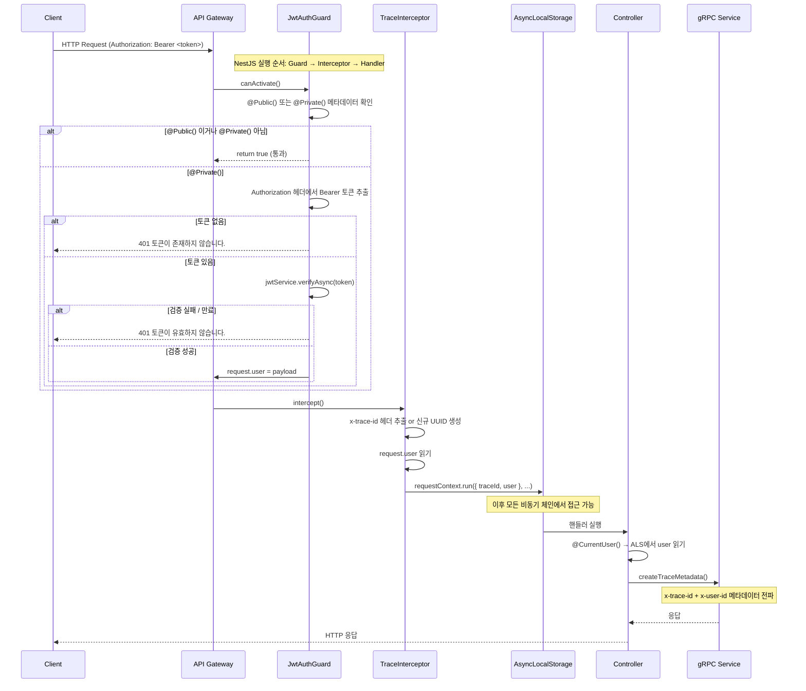
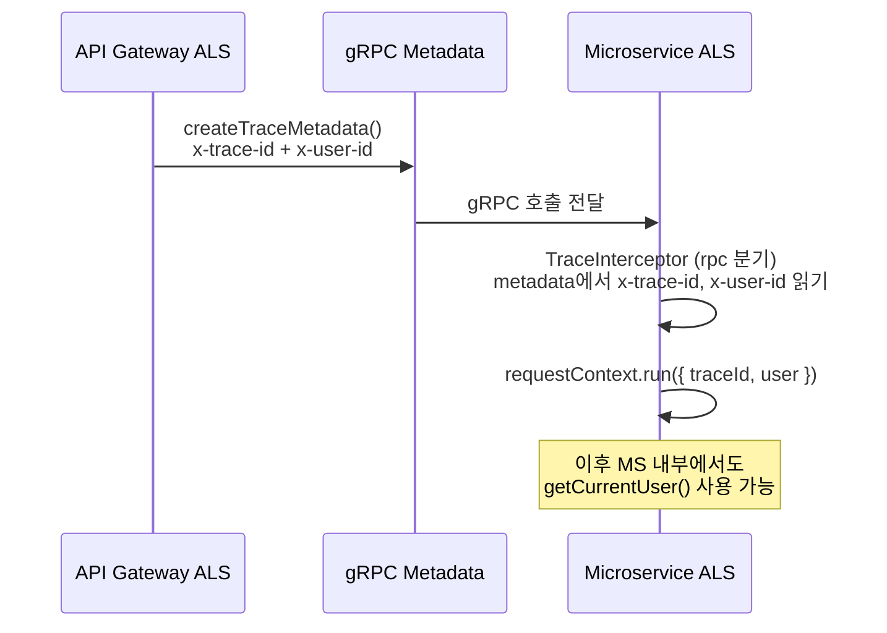
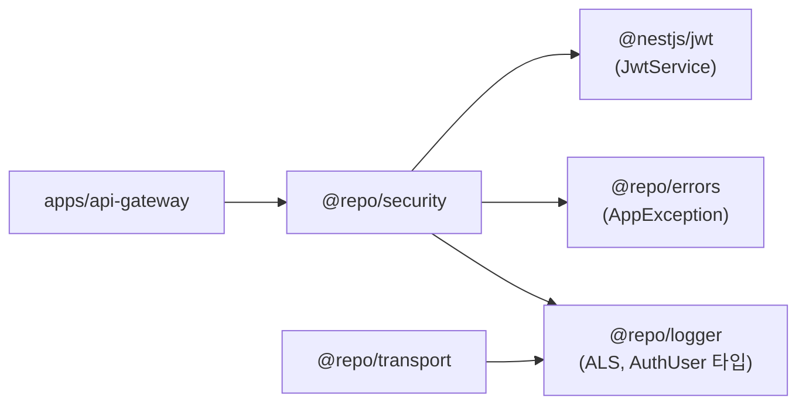

# @repo/security

API Gateway의 인증(Authentication) 인프라를 담당하는 공유 패키지입니다.  
Passport 없이 `@nestjs/jwt`만으로 JWT 검증을 직접 처리하며,  
인증 컨텍스트는 `AsyncLocalStorage(ALS)`를 통해 요청 생명주기 전반에 전파됩니다.

---

## 패키지 구조

```
packages/security/src/auth/
├── auth.module.ts          # JwtModule 전역 등록 (forRoot / forRootAsync)
├── auth.factory.ts         # JwtModuleOptions 생성 헬퍼
├── jwt-auth.guard.ts       # JWT 검증 가드
├── public.decorator.ts     # @Public() / @Private() 메타데이터 데코레이터
├── current-user.decorator.ts # @CurrentUser() 파라미터 데코레이터
└── index.ts                # 전체 re-export
```

---

## 전체 인증 흐름



---

## 핵심 설계 결정: 왜 request.user를 임시 저장하나

Guard는 Interceptor보다 **먼저** 실행됩니다.  
ALS 스코프(`requestContext.run(...)`)는 `TraceInterceptor`가 생성하므로,  
**Guard 실행 시점에는 ALS 스코프가 아직 없습니다.**

```mermaid
flowchart LR
    A[Guard\nJWT 검증] -->|request.user 임시 저장| B[TraceInterceptor\nALS 스코프 생성]
    B -->|traceId + user를 ALS에 주입| C[Handler\n@CurrentUser로 ALS에서 읽기]
    C -->|createTraceMetadata| D[gRPC\nx-trace-id + x-user-id 전파]
```

Guard에서 바로 ALS에 쓰려면 `enterWith`를 사용해야 하는데,  
이후 Interceptor의 `requestContext.run()`이 **새 스코프를 덮어써서** 데이터가 소실됩니다.  
따라서 `request.user`를 경유지로 삼고, Interceptor에서 ALS에 통합하는 구조를 선택했습니다.

---

## 모듈 등록

### 동기 방식

```typescript
// app.module.ts
AuthModule.forRoot({
  secret: process.env.JWT_SECRET,
  options: { expiresIn: '1h' },
})
```

### 비동기 방식 (ConfigService 사용)

```typescript
// app.module.ts
AuthModule.forRootAsync({
  inject: [JWT_CONFIG.KEY],
  useFactory: (jwtConfig: JwtConfigType) => ({
    secret: jwtConfig.JWT_SECRET,
    options: { expiresIn: jwtConfig.JWT_EXPIRES_IN },
  }),
})
```

`AuthModule`은 `global: true`로 등록되므로 한 번만 import하면 됩니다.  
등록 후 `JwtService`가 전역에서 DI 가능해집니다.

---

## JwtAuthGuard

### 동작 흐름

```mermaid
flowchart TD
    A[canActivate 호출] --> B{@Public 메타데이터?}
    B -->|Yes| Z[return true]
    B -->|No| C{@Private 메타데이터?}
    C -->|No| Z
    C -->|Yes| D[Authorization 헤더 파싱]
    D --> E{Bearer 토큰 존재?}
    E -->|No| F[AppException 401\n토큰이 존재하지 않습니다.]
    E -->|Yes| G[jwtService.verifyAsync 토큰]
    G --> H{검증 성공?}
    H -->|No / 만료| I[AppException 401\n토큰이 유효하지 않습니다.]
    H -->|Yes| J[request.user = payload]
    J --> Z
```

### 전역 등록 (API Gateway 권장)

```typescript
// app.module.ts providers
{
  provide: APP_GUARD,
  useClass: JwtAuthGuard,
}
```

전역 등록 시 모든 엔드포인트가 기본적으로 보호됩니다.  
공개 엔드포인트에는 `@Public()`을, 인증 필요 엔드포인트에는 `@Private()`을 붙입니다.

---

## 데코레이터

### @Public() / @Private()

```typescript
// 누구나 접근 가능
@Public()
@Get('health')
healthCheck() { ... }

// JWT 인증 필수
@Private()
@Get('profile')
getProfile() { ... }
```

| 데코레이터 | 동작 |
|-----------|------|
| `@Public()` | 가드를 완전히 건너뜀 |
| `@Private()` | JWT 검증 강제 |
| 없음 | `@Private()`와 동일하게 동작 (`isPublic || !isPrivate`이 false) |

### @CurrentUser()

ALS(`AsyncLocalStorage`)에서 현재 인증된 사용자 정보를 읽습니다.  
`TraceInterceptor`가 ALS 스코프를 만든 이후에 동작하므로, **컨트롤러에서만** 사용합니다.

```typescript
// 전체 user 객체 반환
@Get('profile')
getProfile(@CurrentUser() user: AuthUser) {
  return this.userService.findById(user.sub);
}

// 특정 필드만 반환
@Get('me')
getMe(@CurrentUser('sub') userId: string) {
  return { userId };
}

// 이메일만 반환
@Get('email')
getEmail(@CurrentUser('email') email: string) {
  return { email };
}
```

#### AuthUser 타입

```typescript
interface AuthUser {
  sub: string;        // 사용자 ID (JWT subject)
  email?: string;
  roles?: string[];
  [key: string]: unknown;
}
```

---

## AsyncLocalStorage 컨텍스트 전파

인증 정보는 `@repo/logger`의 `requestContext`(ALS)를 통해 전파됩니다.

```mermaid
flowchart TD
    subgraph Gateway["API Gateway"]
        Guard["JwtAuthGuard\nrequest.user = payload"]
        Interceptor["TraceInterceptor\nrequestContext.run(\n  { traceId, user },\n  ...\n)"]
        Handler["Controller\n@CurrentUser() → ALS 읽기"]
    end

    subgraph ALS["AsyncLocalStorage (요청 스코프)"]
        Store["{
          traceId: 'uuid',
          user: {
            sub: 'user-id',
            email: '...',
            roles: [...]
          }
        }"]
    end

    subgraph gRPC["gRPC Metadata"]
        Meta["x-trace-id: uuid\nx-user-id: user-id"]
    end

    Guard -->|request.user| Interceptor
    Interceptor -->|주입| Store
    Handler -->|getCurrentUser()| Store
    Handler -->|createTraceMetadata()| Meta
```

### ALS에서 직접 읽기 (서비스 레이어)

컨트롤러가 아닌 서비스/레포지토리 등 깊은 레이어에서는 아래 헬퍼를 사용합니다.

```typescript
import { getCurrentUser, getTraceId, getRequestContext } from '@repo/logger';

// 사용자 정보
const user = getCurrentUser();  // AuthUser | undefined

// trace ID
const traceId = getTraceId();   // string | undefined

// 전체 컨텍스트
const ctx = getRequestContext(); // RequestContext | undefined
```

---

## gRPC 컨텍스트 전파

내부 마이크로서비스 호출 시 `createTraceMetadata()`가 ALS에서 자동으로 컨텍스트를 읽어 gRPC 메타데이터에 주입합니다.

```typescript
// grpc service에서 자동으로 traceId + userId 전파
const metadata = createTraceMetadata();
// → x-trace-id: <ALS의 traceId>
// → x-user-id:  <ALS의 user.sub>
```

gRPC 서비스에서 수신 시 `TraceInterceptor`가 메타데이터에서 `x-user-id`를 읽어 ALS에 다시 주입합니다.



---

## 에러 응답 포맷

인증 실패 시 `AppException`을 통해 일관된 에러 포맷으로 응답합니다.

```json
{
  "success": false,
  "timestamp": "2026-03-24T06:00:00.000Z",
  "path": "/api/v1/profile",
  "traceId": "550e8400-e29b-41d4-a716-446655440000",
  "error": {
    "code": "UNAUTHORIZED",
    "message": "토큰이 유효하지 않습니다."
  }
}
```

| 상황 | HTTP Status | code |
|------|-------------|------|
| 토큰 없음 | `401` | `UNAUTHORIZED` |
| 토큰 만료 / 서명 불일치 | `401` | `UNAUTHORIZED` |

---

## 패키지 의존성


